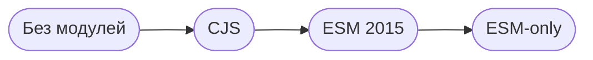

<h1>Немного истории</h1>

<v-clicks>

1. До 2009 - обычные `<script>`, всё в глобальной области
2. CommonJS (2009) - модульная система для Node.js (`require`, `module.exports`)
4. ESM (2015) - официальный модульный стандарт JavaScript (`import`, `export`)
5. ESM-only - ? 🤔👀

</v-clicks>

---
layout: center
---

  

    

    <code>npm-esm-vs-cjs</code>
  

  

    
    <a op80 href="https://github.com/wooorm" target="_blank">wooorm</a>
  

---
layout: center
---

<AnimationText :index="0" words="Какие есть подводные камни ?" />

---
layout: center
---

<AnimationText :index="0" words="Что с совместимостью ?" />

---
layout: center
---

